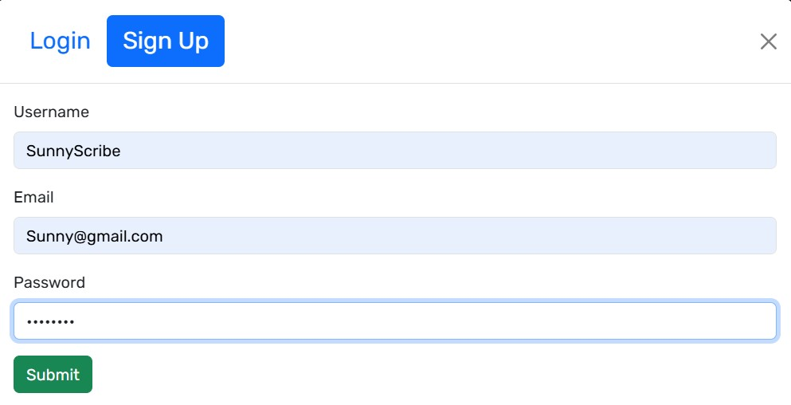
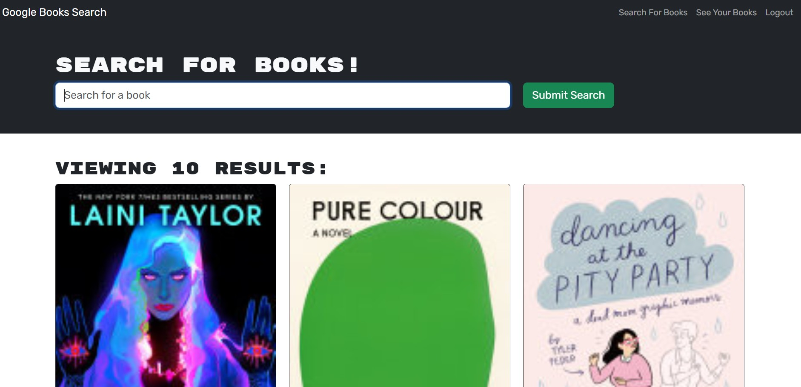
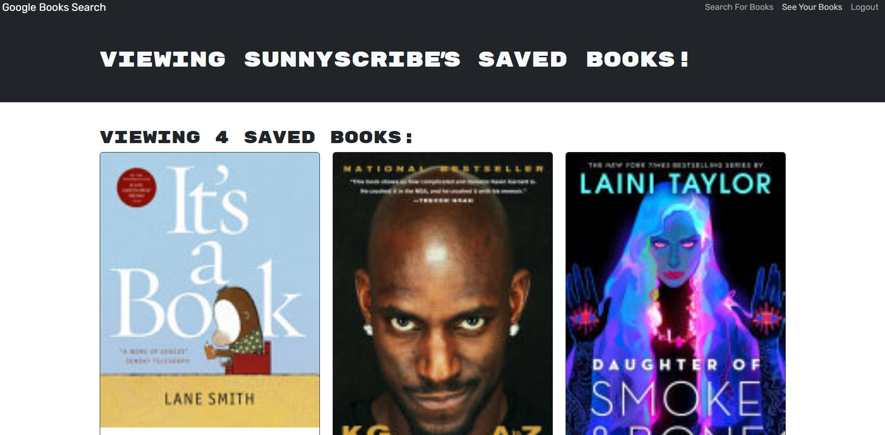

# Awesome Book Search
   

   ## Description

   This is an awesome book search engine built using GraphQL API, Apollo Server and integrates with Google Books API search engine. This app also includes JWT Authentication and has been deployed in Render. The MongoDB resides in MongoDB Atlas.

   ## Table of Contents

   - [Installation](#installation)
   - [Technologies](#Technologies)
   - [Usage](#usage)
   - [Challenges](#challenges)
   - [Tests](#tests)
   - [Future Implementation](#Future-Implementation)
   - [Contributing](#Contributing)
   - [Questions](#questions)
   - [License](#license)

   ## Installation
   The best way to install this Front end React application is to use Render which easily integrates with Github!Render provides logs and statistics as well. Render has seemless integrations with MongoDB Atlas as well.

   ## GitHub Repository and Deployed Application URL
   https://github.com/Mahesh-GH24/awesome-book-search
   
   https://awesome-book-search.onrender.com/    

   ## Technologies
   React, GraphQL, MongoDB, MongoDB Atlas, Google API, Render, JWT, CSS, node & npm

   ## Usage
   Please launch the website deployed in render using this link - https://awesome-book-search.onrender.com/
   You would be landed in the home page. Click the Login / Sign Up link at the top right where you will be directed to a login / sign up page. Please create a new user and you would be automatically logged in. Now, you can search for books which uses the google API to fetch the books. The user can save the books they like using the "Save this Book!" button. The user can then see all the preferred saved books by clicking the "See Your Books" link. Once the user is done using the application, we could hit the Logout link to sign off from the Application. The below screen shots helps you visualize the workflow / functionality

   
   **Screenshots**:

   **Home Page**

   

   **Login / Sign Up Page**

   

   **Search Books Page**

   

   **View Saved Books Page**

   

      
   ## Challenges
   During the project, I had issues with render configurations for the build and deployment process. Otherwise, refactoring the existing RESTful API project to GraphQL and Apollo Server was challenging.
   

   ## Tests
   Ensure the app opens and ensure you are able to navigate into each of the pages as detailed in the usage. You may refer to the above screenshots too.

   ## Future Implementation
   Integrate with online book stores so users could buy them using the link.

   ## Contributing
   Please review the future ideas options and try to contribute or if you find any issues during your testing, please contact me to report issues

   ## Questions
   Please check my GitHub Profile (https://github.com/https://github.com/Mahesh-GH24)  
   Please contact me at MaheshGunasekaran24@gmail.com

   ## License
   Apache License v2.0